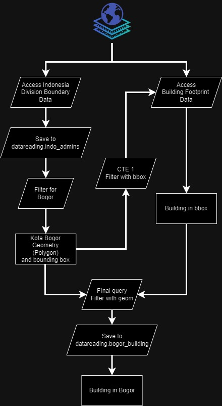
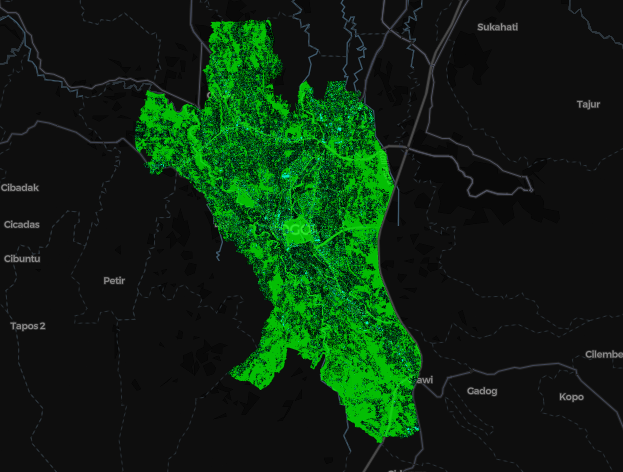

+++
title = "Exploring Overture Building Data with DuckDB (and Lonboard)"
date = 2024-08-18
authors = ["Amri Rasyidi"]
description = "Spatial queries, quick visualization, and open source data."
draft = false

[taxonomies]
series = []
tags = ["data-science", "how-to", "python", "geospatial"]
+++

# The End Result

This is what we are going to make today.
<p><center></center></p>

You can access my code [here](https://gitlab.com/comrades_0/data_reading)

# The Workflow

<figure><center>
  
</center></figure>

The goal is quite straightforward, we want to extract building footprint data inside some administrative boundary, in this case, Kota Bogor.

First, we will have to access the administrative boundary data, in overture map data, it’s stored under `division` theme, with type of `division_area`. Then we filter it by name to get the boundary of Kota Bogor, extract 2 information out of it: the boundary polygon and the bounding box. We need the bounding box to filter the building footprint data from overture map data. I tried to filter the building footprint data directly using spatial query (`ST_Within()`), but it seems that it will take longer than just using the bounding box (I didn’t even get the query completed because of how long it is, so I’m not even sure it will work).

After we get the roughly filtered building footprint data (filtered using bounding box), we will use the boundary polygon to filter it even further.

The step by step can be read below.

# The How To

## Env Setup

For this project, we will only use 3 libraries, geopandas, lonboard, and duckdb. We can even push it further to only 2 libraries by removing geopandas. But for the time being, let us use 3 libraries.

```bash
conda create -n geo_experiment python=3.10
conda activate geo_experiment
conda install ipywidgets ipykernel -y
conda install -c conda-forge geopandas lonboard
pip install pyogrio
pip install duckdb --upgrade
```

Then you should create a folder similar to this, or you don’t have to if you clone my git repo.

```bash
.
├── db
│   ├── datareading.db
│   └── datareading.db.tmp
│       └── duckdb_temp_block-4611686018427388971.block
├── notebook
│   └── overture_building.ipynb
├── readme.md
└── sql
    ├── bogor_building.sql
    └── indo_admin.sql
```

## Setup

The set up is fairly easy, we only need to import the libraries, set up some path, and make some config on for duckdb.

```python
import os
from pathlib import Path

# data processing
import duckdb
import geopandas as gpd

# visualization
from lonboard import viz
```

```python
WORK_DIR = Path(os.getcwd())
PROJECT_DIR = WORK_DIR.parent

SQL_DIR = PROJECT_DIR / 'sql'
DB_DIR = PROJECT_DIR / 'db'

for dir in [SQL_DIR, DB_DIR]:
    if not os.path.exists(dir):
        os.mkdir(dir)
```

Since we are going to download geospatial data from overture map, we will have to install `spatial` extension for duckdb.

```python
# Create or connect to an in-memory DuckDB database
conn = duckdb.connect(
    database=str(DB_DIR/'datareading.db'),
    )

# Install and load the necessary extensions
conn.execute("INSTALL 'spatial'")
conn.execute("LOAD 'spatial'")

# Set S3 region
conn.execute("SET s3_region='us-west-2';")
```

## Get Administrative Boundary

We will download the administrative boundary from [overture map’s division data](https://docs.overturemaps.org/guides/divisions/) into `datareading.db`. To get the specific city boundary and bounding box, some exploration will be needed, that is to find what column to use to filter, and what value to be filled to the filter. In my case, I do the filtering twice, first by the country `AND country = 'ID'`, then search for the specific id by doing some eyeballing to be used on the second layer . So this part will depend on your knowledge of the table/data source itself.

I put some of the queries (the one that contain `CREATE`) into a dedicated `.sql` files. This one is the query to get the administrative in Indonesia, you can modify the condition as you like.

```sql
CREATE TABLE IF NOT EXISTS indo_admin AS
SELECT 
    id,
    division_id,
    names.primary AS primary_name,
    subtype,
    region,
    bbox,
    ST_GeomFromWkb(geometry) AS geometry
FROM
    read_parquet("s3://overturemaps-us-west-2/release/2024-07-22.0/theme=divisions/type=division_area/*", hive_partitioning=1)
WHERE
    TRUE
    AND country = 'ID';
```

In the notebook, we simply read the file, then execute in our connection

```python
# Read the SQL file
with open(SQL_DIR / 'indo_admin.sql', 'r') as sql_file:
    sql_query = sql_file.read()

# Execute the SQL query
conn.execute(sql_query)
```

After this execution, we will have the administrative boundary table stored inside `datareading.db` under the name `indo_admin`, to check, you can run the following script in a new cell. Besides checking, this will also narrow our search for the desired city.

```python
conn.sql("""
SELECT *
FROM indo_admin
WHERE lower(names) = "bogor"
""")
```

Upon checking, I found out the id for the city I want to use. Using that id, we will filter the data then turn it into geopandas dataframe. Why? because we will use the simplest command from lonboard to visualize our data, that is the `viz` syntax. By my understanding, this syntax can visualize multiple layer of data if we store the data inside separate geopandas dataframes.

```python
bogor_geometry = conn.sql(
"""--sql
SELECT
    * exclude (geometry),
    ST_AsText(geometry) as geometry
FROM
    indo_admin
WHERE
    id = '085985123fffffff01be10c12aa9da2c'
""")

bogor_geometry_wkt = bogor_geometry.geometry.fetchone()[0]

bogor_geometry_df = bogor_geometry.to_df()

bogor_geometry_gdf = gpd.GeoDataFrame(
    bogor_geometry_df,
    geometry= gpd.GeoSeries.from_wkt(bogor_geometry_df['geometry']),
    crs="EPSG:4326"
)
```

if you are wondering why the `--sql`, I’m using Inline [SQL extension for VS Code](https://marketplace.visualstudio.com/items?itemName=qufiwefefwoyn.inline-sql-syntax), it doesn’t do much, but it helps with SQL syntax highlighting in jupyter notebook cell. If you have a good extension to work with SQL file in VS Code, let me know!

## Get the building

We will use the bounding box information from our previously created table, `indo_admin` to filter the building footprint, so we only accessing the building within that bounding box. This saves us time and resource as the complete building footprint data might be gigabytes in size.

After we get the building inside the bbox from overture, we filter it again so the final table stores only building within the boundary.

This is `bogor_building.sql`.

```sql
CREATE TABLE IF NOT EXISTS bogor_building AS

WITH
bogor_geom AS (
    SELECT
        id,
        ST_GeomFromWkb(geometry) AS geometry,
        bbox.xmin as xmin,
        bbox.xmax as xmax,
        bbox.ymin as ymin,
        bbox.ymax as ymax
    FROM
        indo_admin
    WHERE
        id = '085985123fffffff01be10c12aa9da2c'
)
,
bogor_building_bbox as (
    SELECT
        id,
        level,
        height,
        names AS names,
        sources[1].dataset AS primary_source,
        sources AS sources,
        ST_GeomFromWkb(geometry) AS geometry
    FROM
        read_parquet('s3://overturemaps-us-west-2/release/2024-07-22.0/theme=buildings/type=*/*', filename=true, hive_partitioning=1) buildings
    WHERE
        TRUE
        AND bbox.xmin > (SELECT xmin FROM bogor_geom)
        AND bbox.xmax < (SELECT xmax FROM bogor_geom)
        AND bbox.ymin > (SELECT ymin FROM bogor_geom)
        AND bbox.ymax < (SELECT ymax FROM bogor_geom)
)

SELECT
    *
FROM
    bogor_building_bbox build_bbox
WHERE
    TRUE
    AND ST_Within(build_bbox.geometry, (SELECT geometry FROM bogor_geom));

```

We can run it in jupyter notebook by executing this cell.
```python
# Read the SQL file
with open(SQL_DIR / 'bogor_building.sql', 'r') as sql_file:
    sql_query = sql_file.read()

# Execute the SQL query
conn.execute(sql_query)
```
In my notebook however, you will see the cell to create `bogor_building` table is longer than this. This is because, when I run the query, I got `OutOfMemoryError`, it seems that my machine can handle executing 2 CTE, hence I create an alternative in case the sql script doesn't work. I refactor the logic so it only has 1 cte, then get the bounding box by running a separate query.

Similar to the previous step on getting the administrative boundary, we will also turn it into geopandas dataframe.

```python
bogor_building_df = conn.sql(
"""--sql
SELECT
    * exclude (geometry),
    ST_AsText(geometry) as geometry
FROM
    bogor_building
""").to_df()

bogor_building_gdf = gpd.GeoDataFrame(
    bogor_building_df,
    geometry= gpd.GeoSeries.from_wkt(bogor_building_df['geometry']),
    crs="EPSG:4326"
)
```

# Visualization

Visualization is straightforward because we are using the high level syntax `viz`. You can make customization to the visualization if you are using the lower level syntax such as `Map` and `PolygonLayer`.

```python
viz((
    bogor_geometry_gdf,
    bogor_building_gdf
))
```
<figure><center>
  
</center></figure>

# What's next

As you can see in our final result, we can still improve the coloring, layer order, and many other things. But the `viz` syntax is not as customizable, that is why, you may want to consider using `Map` and `PolygonLayer` to make other customization.

But I guess das it for today. I hope you enjoyed the tutorial and successfully try it on yourself.

See you later!