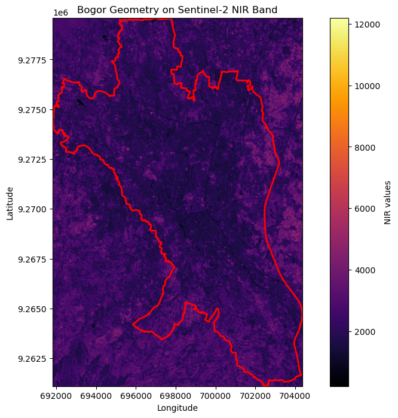
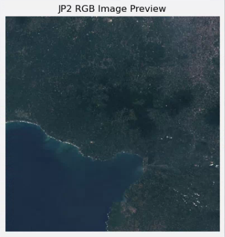

+++
title = "Exploring Cloud-Optimized GeoTIFF with STAC in Python"
date = 2024-11-03
authors = ["Amri Rasyidi"]
description = "Spatial queries, quick visualization, and open source data."
draft = false

[taxonomies]
series = []
tags = ["data-science", "how-to", "python", "geospatial"]
+++

# The End Result
This is what we are going to make today.
<p><center></center></p>

You can access my code [here](https://gitlab.com/comrades_0/data_reading/-/blob/master/notebook/2_sentinel_from_copernicus.ipynb?ref_type=heads)


# Some Intro First
Have you ever dealt with many images at once which somehow need to be queried based on some criteria. Let's say you have images of animals. One way to manage it is to make folders, using the animal name as the folder name. Images with cats in it will go to "cat" folder and so on. Easy right? But now some images contain multiple animals, should you put the image in multiple folder or do you make another folder with multiple animal name? To add some more complexity, what if you want to query something goofy, the "state" of the animal, is it walking? sleeping? standing up? drinking?

Have you? No? Okay. At least entertain your thought that you are important enough to deal with this kind of problem now.

Another way to approach this problem is by using [vector database](https://www.pinecone.io/learn/vector-database/). But at this point, our "many images" is not that many it doesn't really qualify as big data, vector database might be overly complex and an overkill.

You have this query problem in geospatial context you say? Enter [STAC](https://stacspec.org/en/tutorials/intro-to-stac/).

## STAC - Spatio-Temporal Asset Catalogue
<figure><center>
  
</center></figure>

When looking for a satellite imagery, you might want to filter it by some kind of properties. You are given a task to analyse a site before and after a landslide to see the impacted neighborhood. It doesn't make sense to analyse the imagery 1 year after the landslide, the site most probably already fully recovered, you might be interested in the imageries a day to a week after the landslide. You might also want to consider the cloud coverage to make sure the imageries can be analysed.

This is exactly what STAC is useful for.

STAC is basically a standard on how to organize satellite imagery, or as the name state spario-temporal assets. Since the [documentation](https://stacspec.org/en/tutorials/intro-to-stac/) did a great job explaining it, I won't explain about STAC here.

<figure id="stac-structure">
  
  <figcaption>most relevant image for this post</a></figcaption>
</figure>


## COG - Cloud-Optimized GeoTIFF

A `.tiff` is an image format.

A geo-`.tiff` is a `.tiff` with some additional tags containing information about where the image exists on earth. This includes things like map projections, coordinate systems, datums, etc. Basically lots of interesting geodspatial  relevant info that provides a spatial reference ([source](https://developers.planet.com/docs/planetschool/an-introduction-to-cloud-optimized-geotiffs-cogs-part-1-overview/)).

A COG is a geotiff file that has been optimized to live in the cloud. Mostly it revolves around how the image is "assembled" and stored. Since cloud-based-anything has been ubiquitous nowadays, COG importance is unneglectable. 

# Da Code
To simplify the process, these are the steps that we are going to do:
1. Connect to the STAC client, and look for the suitable STAC collection 
1. From the collection, filter to get our item of interest
1. From the STAC item, get the asset and open it using raterio.

Simple enough right? Let's get to it!

## Stack
Libraries will be needed:
1. [pystac_client](https://pystac.readthedocs.io/) - to connect with the STAC client
1. [rasterio](https://rasterio.readthedocs.io/en/stable/) - for the imagery analysis and previewing.
1. [geopandas](https://geopandas.org/en/stable/docs.html) - a minor dataframe-based analysis will be done, "normal" pandas will also do.
1. [duckdb](https://duckdb.org/) - optional - I'm using this because [previously](@/11_overture_duckdb_building/index.md) I also used duckdb to store some relevant geospatial information.

## Connecting with a client
There are options of STAC client, I guess among the most popular one are:
1. AWS COG by Element84 - `https://earth-search.aws.element84.com/v1`
1. Microsoft Planetary - `https://planetarycomputer.microsoft.com/api/stac/v1`
There also _might_ be from [source.coop](https://source.coop/), but I'm not sure do they have their own STAC client or they will refer you to other links.

Connecting is easy, just import the library and open the url

```python
from pystac_client import Client

api_url = "https://earth-search.aws.element84.com/v1"
client = Client.open(api_url)
```

Then you can check, what are the available collections in that specific client.
```python
for collection in client.get_collections():
    print(collection)
```
```
<CollectionClient id=sentinel-2-pre-c1-l2a>
<CollectionClient id=cop-dem-glo-30>
<CollectionClient id=naip>
<CollectionClient id=cop-dem-glo-90>
<CollectionClient id=landsat-c2-l2>
<CollectionClient id=sentinel-2-l2a>
<CollectionClient id=sentinel-2-l1c>
<CollectionClient id=sentinel-2-c1-l2a>
<CollectionClient id=sentinel-1-grd>
```
## Searching for the item

As its basic usage, you can filter your collection by using location attribute and the name of the collection, in this post I'm interested in searching at the `sentinel-2-l2a` collection. As for the coordinate, you can create a `shapely` point geometry using longitude and latitude in WGS84 coordinate reference system (WKID: 4326)

```python
# initiate the variable for query
collection = "sentinel-2-l2a"
point = Point(longitude, latitude)

search = client.search(
    collections=[collection],
    intersects=point,
    query={"eo:cloud_cover": {"lt": 1}}
)
```

The search object contains some items inside it (refer to the <a href="#stac-structure">structure</a> if you are not sure), you can look at it by iterating through it.

```python
items = search.item_collection()
for item in items:
    print(item)
```
It will print these lines
```
<Item id=S2A_48MXT_20210812_1_L2A>
<Item id=S2A_48MXT_20210812_0_L2A>
<Item id=S2A_48MXT_20210424_0_L2A>
<Item id=S2B_48MXT_20190619_0_L2A>
```

We will use this item id to find the `asset`. This `asset` contains the actual link to our imagery. Now, depending on your use-case, you might only interested in a specific imagery or maybe some of them. For example, if you want to make a timeseries analysis, you certainly need more than 1 imagery.

Since the search object contains several item id, there are variety of ways to get the imagery that suits your need, the most common attribute to be looked at is probably the <b>cloud coverage</b>. Imagery with high cloud coverage usually are harder to analyze. Another crucial attribute is the <b>acquisition date</b>. For natural disaster-related use case, it is super crucial to find the imageries that relevant to the event. These 2 attributes and many other attributes are recorded as part of the STAC metadata, and can be used as a query parameter.

In my example, I only use the cloud coverage as my query parameter. To be more specific, from my search result, I took the imagery that has the least cloud coverage.

## Get the asset

Now that we have the item id that we are interested in, we can use that item id as our query parameter to search in the STAC url.
```python
items = client.search(ids=[lowest_cloud_item_id]).item_collection()
```
This `items` is a `List`, at this point, since we're using a specific item id, the list will only have 1 item. This item have some assets inside, depending on the item you have, different number of asset will be included inside it. In this case, the Sentinel-2-L2A has 35 assets inside, that is 12 bands of sentinel 2 bands, in 2 formats, `jp2` and `tiff` and some other additional information such as `thumbnail` and `tileinfo_metadata`.

```python
# Check if the item was found
if len(items) == 0:
    print(f"No item found with ID: {lowest_cloud_item_id}")
else:
    item = items[0]
    print(f"Found item: {item.id}")

    # Retrieve the asset URLs
    for asset_key, asset in item.assets.items():
        print(f"Asset Key: {asset_key} - {asset.title}, URL: {asset.href}")
```
If your item includes `thumbnail` as its asset, you're in luck! Since sattelite imageries is usually very large, a thumbnail can help you preview if it is the correct (or the suitable) imagery for your use case.

To check it you can do it like so

```python
# URL of the image
thumbnail_url = item.assets['thumbnail'].href

# Open the JP2 file using rasterio
with rasterio.open(thumbnail_url) as dataset:
    # Read the red, green, and blue bands (usually 1, 2, and 3)
    red = dataset.read(1)
    green = dataset.read(2)
    blue = dataset.read(3)

    # Stack the bands into an RGB image (normalize to [0, 255] range)
    rgb = np.dstack((red, green, blue))

    # # Normalize the RGB image (optional if the values are not in the [0, 255] range)
    # rgb_normalized = np.clip(rgb / np.max(rgb) * 255, 0, 255).astype(np.uint8)

    # Plot the image using matplotlib
    plt.figure(figsize=(5, 5))
    plt.imshow(rgb)
    plt.title('JP2 RGB Image Preview')
    plt.axis('off')  # Hide the axes
    plt.show()
```
Then something like this should appear
<figure id="stac-structure"><center>
  
  <figcaption>da thumbnail</a></figcaption>
</center></figure>

# Dasit!

That's that. You can ofcourse continue by using the real asset you're interested in, if you want to create an image composite such as NDVI, you may want to use the red and near-infrared assets. You wan to visualize the real-color imagery? Use the red, green, and blue bands. You do you.

To get the final result like at the <a href="#the-end-result">start of this post</a> you only need to use the near-infrared band then overlay the geometry on top of the imagery plot. As always, you can check the complete code on [my repository](https://gitlab.com/comrades_0/data_reading/-/blob/master/notebook/2_sentinel_from_copernicus.ipynb?ref_type=heads).

That's all for this post.
See you later!
