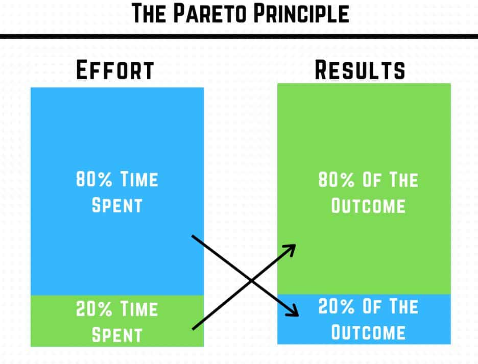

+++
title = "Better Way to Learn Data Science"
date = 2023-06-30
authors = ["Amri Rasyidi"]
description = "My retro on how I can learn data science better."

[taxonomies]
series = []
tags = ["data-science", "career-retro", "how-to"]
+++

# TL;DR

I'm sharing here what could you do to learn data science using Python more effectively and more efficiently, they are:
1. Don't get stuck in the math
1. Focus on creating a simple real product
1. Problem/solution-oriented learning

---

The year was 2018 when I was first introduced to Python. A friend of mine, mentioned it when I’m asking about data processing tools. He told me about this magical language where I can have the flexibility to play with data, a very versatile one, he’s almost described it as “*like MATLAB, but with steroid*” (I was using MATLAB back then). 

And I thought, “*wut?*”

It was completely new to me, a strange and foreign concept of “data processing” programming language. Back then I was almost certain that after graduating, I’ll be working in the field, surveying, gathering data, then processing it with the usual suspects of data processing software known by many geospatial science/engineering students. Python was not one of them.

Like almost every freshman in ITB at that time, I learn a bit about C. I was struggling to wrap my head around the concept/paradigm of C. Part of it because I’m questioning myself, “*What the fuck do I need to learn all of these for?*”

Then there was Python. I looked into it shortly after being introduced by my friend. It was a language for babies in comparison with C. Learning the basics was not really hard. What hard still was, figuring out how is this useful for me.

Since I was in a field-oriented major, my exposure to these programming languages was very limited, hence my limited learning resources. To be fair, the concept of machine learning, and even deep learning, was introduced in some of my classes. But those were more like easter eggs. An *“if you know, you know”* thing.

I don't have the slightest idea of how to learn Python. My menu back then roughly looks like this:
- I took courses on statistics and probability in _many_ learning platforms. Then almost never put the concept into practice.
- I read some books about Python, data science, and machine learning here and there.
- I rarely code, which is very weird in hindsight, but that was because, well...I have no idea what I'm going to code.

---

The year is 2023, and the table has turned. My YouTube feed consistently suggests Python/programming videos. I know many more resources to learn about Python. I have some ideas about how Python can be used, especially in the context of data science.

I'll pour into this post about how can you learn to use Python for data science more efficiently.

# Less Math

OK, my first take is already controversial.

In the early stage of learning data science and Python, I stumbled upon this Venn diagram many times.

<figure>
  
  <figcaption>what they told me</a></figcaption>
</figure>

But, in _my_ reality, it feels more like this one.

<figure>
  
  <figcaption>what it feels like</figcaption>
</figure>

These illustrations don't really make sense lol.

But I mean, there's not so much you can do about the math & stats aspect while doing data science. **Experimentation** (like A/B testing) is the one case that I can think of where the understanding of statistics can come in really handy.

To be fair though, I got 2 semesters of both Calculus and Statistics, I got a decent grade too (let me brag a bit while we're at it). And my whole major, Geodetic Engineering, is about making a mathematical calculation on the earth, it is a branch of applied math.

So no doubt, having those 2 in my armoury, make it easier for me to grasp the math and stats concept while learning data science.
What I'm trying to say is, while of course math & stats are important in data science, **don't focus on them *too much***.

  

    💡
  

  

    
Presumption of <i>unimportance</i>: <b>everything is unimportant until it is important</b>.

  

 

If someone ask you "_What minimal math theories, knowledge, or skills does a data science need to thrive in the industry?_", what would be your answer?

You don't have to delve deep into math unless you really need to master it in your project. The thing is, there are many PhDs mastering these math concepts for data science. I don't think I have a chance of being at the same level as them about the math & stats concepts, especially as a self-taught. So when it comes to the math & stats concept, it is better to put yourself in a more "worker" position rather than the "thinker", a "cook" rather than a "chef". But when it comes to the practical side, oftentimes you don't need a PhD in your title, that's why I think you better put more effort and time to cover this side.

Aim for the low-hanging fruit.

Which leads me to the next point...

# Create, create, create

>_At the end of the term, he was surprised to find that all the best photos were produced by the quantity group. During the semester, these students were busy taking photos, experimenting with composition and lighting, testing out various methods in the darkroom, and learning from their mistakes. In the process of creating hundreds of photos, they honed their skills. Meanwhile, the quality group sat around speculating about perfection. In the end, they had little to show for their efforts other than unverified theories and one mediocre photo._  - [James Clear](https://jamesclear.com/repetitions) in "Atomic Habits".

Deploy your minimum viable product (MVP), fast.

A good thing when it comes to learning data science is that you can immediately see the result of what you are building. Leverage this. You _need_ to have the thrill of deploying a product, or simply to see your project working for that matter.

Put your work on social media, make a short writing about it. Will be even better if you can deploy your product as a web app.

This creates an improvement loop. Once you deployed your DS product, you will feel a sense of accomplishment. In my case, this triggers me to create even more, or in some cases, to improve the finished MVP. You will also feel like, your next project should somehow be better than the previous one, and maybe has a novelty aspect to it.

A virtuous cycle.

## Some tips

Some tips for you and a reminder for me on how to put mindset into action.

### Aim for the _shit_ MVP first, perfection comes later

Most of the time, it has to be shit. Don't worry about UI/UX, don't worry about intuitiveness. Remember, you're your first customer. Serve yourself first. If it's working for you as you expected, that's an MVP.

And While planning for the project, don't put "_dethrone chatGPT_" in one user story. That's maybe your long-term vision, but to create a MVP **break it down into something that you can work on a week or two**.

### Remember the pareto principle

>_The Pareto principle states that for many outcomes, roughly 80% of consequences come from 20% of causes._  - [Wikipedia](https://en.wikipedia.org/wiki/Pareto_principle)

<figure>
  
  <figcaption><a href="https://www.zen-tools.net/pareto-principle.html">source</a></figcaption>
</figure>

Put simply, roughly 20% of your efforts are accountable for 80% of the outcome.

This again, is why you should focus on the MVP, not the perfect product. While spending 20% of your effort/time, you can already achieve the 80% version of your full product.

And yes, of course, this is not a fixed number. The point is the imbalance between the time spent and the outcomes.

# Project Based Learning

Now you know the basics, you are confident enough with what you have and you think you can move along to the next step.

But where's the next step?

After learning data science with Python for a while, I noticed that there are no "intermediate" courses, or at least I never found one. And there were a few "advanced" courses, which on closer look, many of them are actually just beginner courses + a project or two.

I believe some of the reasons there are rarely intermediate or advanced courses are:
1. It is "not teachable" by course.
1. Intermediate and advanced concepts are just a mix of basic concepts. In other words, there is just no such thing as intermediate or advanced, only basic.

Also, now you are probably bombarded with a lot of data science and Python content, but you are not sure which one to learn, and more importantly, which one is actually helpful/useful for you. In this case, you can just consume whatever data science and Python content is shoved into your feeds by the algorithm god. But that could be far from efficient.

Rather than learning many things that you are not even sure about their importance, doing a project will tell you _what_ is important.

Then you ask, "_What kind of project do I need to work on?_"

## Replicate

When in doubt, replicate!

Find a completed project, then reverse engineer the code. Put yourself in a hacker's shoes. Ask yourself, what are those lines of code for? Why does the author make it like that? What is the importance of this syntax? Why use this library? etc etc.

You can find them by googling, for example, "_flood prediction using Python_" or "_retail product recommendation machine learning_". Most of them will be in a YouTube video, Medium writing, competition platform (like Kaggle), or the best one is a GitHub repository.

However, chances are, you don't find the exact project as your search keyword. That's okay, as long as you can find similarities between what you want and the existing one, you can adapt. The product recommendation, for example, you may want the use case to be a retail store, but what you found is book or movie recommendations. They are both probably using the concept of matrix factorization or collaborative filtering, basically the same things, in different areas.

You can also try to recreate those projects using something different, "translate" the code into different libraries or frameworks, use different data, etc etc.

## Mastery

Referring to the [associate certification](https://pythoninstitute.org/pcap-exam-syllabus) by Python Institute, I can only think 1 thing that can be classified above basic, that is "object-oriented programming".

That is why, again, project-based learning is king. Focus on mastering the project that you are replicating or working on out of your own idea, you will automatically search for things that are actually useful for you to complete the project. 

Once in a while, you'll feel stuck while working on a project. This most likely is due to a lack of foundational knowledge or information. In this scenario, you may want to put the project to a halt and learn something basic by reading before continuing. It is completely fine to do that, you **should** do that every now and then. But remember the "presumption of unimportance".

Or just put it aside and take a break really.

  

    💡
  

  

    
Only learn the basic, <b>mastery comes while doing a project</b>.

  

---

# Ending notes

Some other things that are worth mentioning about learning data science.

## "Certificate of Completion" Means Nothing...

...if you don't put what you've learned into practice.

You'll be expected to bring something to the table. And those certificates _alone_ won't do shit.

While I still think projects are more valueable to be showcased, there's no shame in taking a data science or machine learning course. Just remind yourself not to chase those certificates mindlessly.

## You Are A Problem Solver

Starting out, you may want to focus to be able to create something. Create, create, create. You may just replicate project after project. Even when you don't find the projects useful. **That is okay**. Your aim now is to be able to comfortably write the code or using the tools.

But after a while, you may want to produce something that can add some value to a problem. After all, data scientists exist to solve a real problem, not to just code aimlessly.

## Learning Loop

And as a data scientist, you will always be a beginner in a sense, many many many times.

- It's your first step to learn data science with Python. You are probably using pandas now. You're obviously a **beginner** now.
- Then you want to speed up? Learn polars, You're suddenly a **beginner again**.
- You are working in a bigger company now, the data is huge and they use cluster computing. Learn PySpark, **beginner again**.
- You are learning how to use deep learning concepts in Python? Again, obviously a **beginner** in deep learning.
- Now you can use deep learning using TensorFlow, you want to do it with PyTorch? You're suddenly a **beginner again**.
- You can do all of the above, but you are now working in a different business case? Well...

The good thing is, since you are not throwing away the previously learnt concepts, your learning curve and pace will be more efficient and faster after each iteration. You are getting better at learning. Made you a _learning machine_ almost literally, lol.

## Specialization

I've heard a metaphor called "T-shaped person". A "T" understands many things, but may go deep in some of it. You may want to be this kind of person as a data scientist.

  

      <figure>
        
        <figcaption>This one</figcaption>
      </figure>
  

  

    <figure>
      
      <figcaption>Not this one</figcaption>
    </figure>
  

Data science is a spectrum, a wide one that is. If you don't know yet what are you going to commit to, creating as many projects/products as possible may give you _guidance_ on what specialization should you pursue.

Along the way, you'll experience it by yourself, you will know you prefer some of the disciplines over others.

---

Thanks for reading this far! I hope you have an enjoyable data science learning journey.

When you feel like stuck, remember that progress is not always linear.

