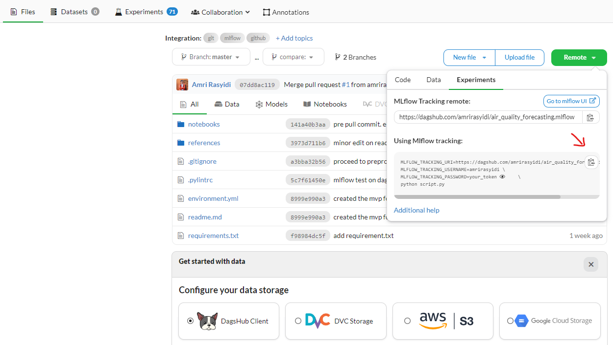

+++
title = "PyTorch Experimentation in Dagshub With MLflow"
date = 2023-09-10
authors = ["Amri Rasyidi"]
description = "The integration of MLflow within Dagshub to do deep learning experimentation using pytorch"
draft = false

[taxonomies]
series = []
tags = ["data-science", "how-to", "python", "deep-learning"]
+++

It turned out, deep learning is very exciting. After several weeks (or even months) of exploring, I managed to make a "mockup" project of using deep learning framework to make an image classification and timeseries forecasting.

This post is an effor to review what I've learned. I'll break it down into 2 pieces, the deep learning part and the experimentation part (MLflow).

# Pytorch Zero to Master (ZTM) by Daniel Bourke
If you have a bit of knowledge of deep learning and want to take it to the next level, [this course is highly recommended!](https://www.learnpytorch.io) In the past, I've explored another deep learning framework in python called TensorFlow. Somehow, I feel deep learning is more fun using Pytorch. I might be biased because when I first learn about deep learning using TensorFlow, I don't really use a structured learning material to learn it. I might try to complete the [TensorFlow ZTM](https://dev.mrdbourke.com/tensorflow-deep-learning/) later, to prepare for the tensorflow developer certification.

The course has 10 sections. Started with the very fundamental (tensor, common error, run with GPU etc) and closed with deep learning model deployment.

Every section is a google colab jupyter notebook. Each section begins with theories (learning material) and its explanation, then by the end of the notebook, there will be an exercise about what you've just learned.

The first 4 sections are foundational level, I finished it 1-2 days each. Things started to get more complicated from the 5th section "Pytorch Custom Datasets". From this point forward, I need 3-7 days to complete each of them. And by complete I mean: read the the learning material, complete the exercise, and read the extra-curriculum. However, some of the extra-curriculum lead to other courses, obviously I don't complete those courses.

## EuroSAT Image Classification

This project was driven by mainly 3 points: my domain in earth science, my interest in computer vision, and me wanting to apply what I've learn in different use case.

As I wrote before, the ZTM course is a complete course with a project and mini project up to the deployment stage. But I don't want to just use the example in the course as the project. So I came up with a slightly different use case, still an image classification use case, but in different field.

This project mainly serve a purpose as a complementary to completing the course by creating a slightly different use case. So I still follow the similar steps explained in the course, but add some "novelty" here and there, mostly in the dataset and model selection part, the other parts are very similar. This adds the challenge where if I found a problem trying to complete my project, I won't have a "cheat sheet" and just look (and copy pasted) from the course.

Here is the [deployed model in HuggingFace](huggingface.co/spaces/arasyidi/eurosat_ztm_practice) in case you want to try it out.

## Timeseries forecasting with LSTNet

Different from the EuroSAT case, this time I want to explore more about MLOps, or at least a part of it, experimentation. The ZTM course has a dedicated section for experimentation. That section explains and shows how to use tensorboard to monitor the experimentation result. In that section, there are other alternatives to tensorboard to complete a similar task. This time I want to use MLflow.

I chose it because the MLflow symbol looks good and the color is blue. Yes, that is a real reason.

The first timeseries forecasting with deep learning framework I tried was LSTNet. I picked it because it was one of the very first timeseries forecasting deep learning model architecture I found (from [paperswithcode.com](https://paperswithcode.com)). The original LSTNet itself is actually for multivariate use case, this is kind of a problem for me, because usually, multivariate implies a requirement for domain expertise. My choice of use case is air quality index (AQI) forecasting, and heck, what do I know about AQI?

So my first task is to convert this LSTNet from multivariate to univariate, then also to understand the basic of how it works and how to make them work for my use case. Here's where reading the paper and some more internet exploration helps.

While doing the exploration, I found [PyTorch Forecasting](https://pytorch-forecasting.readthedocs.io/en/stable/index.html) a library that help with state-of-the-art or SOTA (I don't know what are the meaning of these words) of timeseries forecasting with pytorch (I suspected many other use cases have their own libraries just like this one). But at this point, I've sucessfully cloned the LSTNet repository and run it as is, also there was so much effort to turn it into a univariate model, so there it is: ✨ _sunk cost fallacy_ ✨.

<!-- You can find the ~~complete~~ work in progress repository in my [github](https://github.com/amrirasyidi/air_quality_forecasting/blob/master/notebooks/2_lstnet_pipeline.ipynb). -->

# MLflow

I tried MLflow out of curiosity. And also a potential next step after learn about data science and deep learning is to learn about MLOps. From my understanding, beside collaboration and deployment, experimentation is also a huge part in MLOps.

From the official documentation, there are five components of MLflow, namely:
1. Tracking
1. Models
1. Model Registry
1. Projects
1. Recipes

In my mockup project, I only utilized the first component, tracking. So I haven't really explore the other components as much.

Remember the sunk cost fallacy I wrote previously? It pays even more now. Turns out, MLflow have an automatic logger. This automatic logger can make the logging process, well...automated. However, MLflow requires the PyTorch model to be in pyTorch-lightning form. I managed to turn the LSTNet into its lightning form, but there's a problem, somehow when I run the lightning framework on GPU, it doesn't work. It says my data and the model is not on the same device, one of them is on GPU, the other is on CPU. I don't know which one in which because when I check it, both are on GPU.

Turning it into lightning also requires a bit of tweak on the training pipeline because there are some more requirements from pytorch-lightning. I think I can actually run it in CPU instead, but in the end, I make my own experimentation pipeline instead of using lightning and autologger. At this point it seems easier this way.

My experimentation set up ended up looking like this:

I'll tell you about the username and password in the dagshub section below...

## Dagshub
I sucessfully run the MLflow UI the first time by running it within dagshub. For some odd reasons, the local mlflow ui didn't work in my machine.

I heard about dagshub while learning about MLflow and experimentation. Similar to MLflow, I suspect there is still many capabilities I haven't explored yet. As a brief, dagshub seems like a repository enhanced for data science use cases, such as data preparation, experimentation, model registry, etc.

Just by the first glance, dagshub interface is similar to github. Upon creating a dagshub repo (I did this by connecting to my github repo, so not really "creating"), you'll see some options on data storage and data pipeline. You'll also see experiment, collaboration, and annotation tabs.

<figure>
  
  <figcaption>dagshub interface</a></figcaption>
</figure>

In the repository, you can click on "remote" then a pop up will show up, make sure the pop up tab is in "Experiment" where you can find the credentials for your repo to be used later. Just copy it and store it somewhere. This credentials will help MLflow to find where is the experimentation should be run and stored.

The `MLFLOW_TRACKING_URI`, `_USERNAME`, and `_PASSWORD` is what you need to complete the gist above.

## Local
Have you ever have a problem that you are trying to solve, then you ask your friend for an advice, then they be like "ok, can you show me the problem", then you try to reproduce the problem, then it just gone, the problem just get solved?!?!??

It just happened to me...

The only reason I use dagshub before run the UI locally is because it threw me an error that I don't understand. So I have no idea how to debug it. I even asked it in StackOverflow (I deleted the question).

Anyway, running MLflow locally _should_ be easy, you only need to install the library, then just run `mlflow ui` from the terminal (you may also want to activate the python env where you installed mlflow).

--- 

I guess that's that for now.

There are still many thing to explore in the realm of MLOps. I'll try to make a use case where DVC is needed. Then perhaps deploy the model, probably on HuggingFace. I'll also use pytorch lightning to try out the pytorch mlflow autologger.

See ya.
