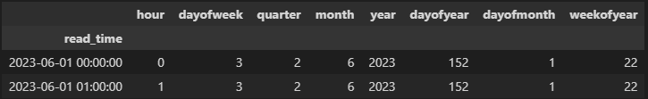

+++
title = "XGBoost, MLflow, Dagshub, and Optuna for Time Series Forecasting"
date = 2023-09-22
authors = ["Amri Rasyidi"]
description = "Using optuna for XGBoost experimentation in time series forecasting use case"
draft = true

[taxonomies]
series = []
tags = ["data-science", "how-to", "python"]
+++

<figure>
  
  <figcaption>What a title huh?</a></figcaption>
</figure>

---

Many people say machine learning is half art half science. To me, experimentation has the sense of art in it. In that we need to find the best configuration of values to create the most optimized model for our case.

For python, there are tools and library to make the process less tedious and troublesome, to make the result more explainable and accessible.

Before I blabber some more unnecessary words, let’s see what are they.

Let’s start by looking at the completed minimally reproducible example (MRE). Well, not really an MRE because it requires some other function which I don't include here, but it is what it is...

# This is ~~not even~~ my final form

This is my MRE version, only including the training experiment part, left out the data preparation. We will dissect this script part by part, even back in time to see the simpler version of it then walk step by step until we reach this form again.

```python
# env setting for mlflow within dagshub
os.environ['MLFLOW_TRACKING_USERNAME'] = secrets['MLFLOW_TRACKING_USERNAME']
os.environ['MLFLOW_TRACKING_PASSWORD'] = secrets['MLFLOW_TRACKING_PASSWORD']
os.environ['MLFLOW_TRACKING_URI'] = secrets['MLFLOW_TRACKING_URI']

# creating new experiment
experiment_name = "xgboost_optuna_test"
# Check if the experiment exists, and if not, create it
if not mlflow.get_experiment_by_name(experiment_name):
    mlflow.create_experiment(experiment_name)
experiment_id = mlflow.get_experiment_by_name(experiment_name).experiment_id

# Define an optuna objective function to be minimized.
@mlflc.track_in_mlflow() # add an optuna decorator for additional logging in mlflow
def objective(trial):
    param = {
        'objective': 'reg:squarederror',
        'max_depth': trial.suggest_int('max_depth', 3, 10),
        'eta': trial.suggest_float('eta', 1e-4, 0.1),
        'subsample': trial.suggest_float('subsample', 0.4, 0.8),
        # 'colsample_bytree': trial.suggest_float('colsample_bytree', 0.4, 0.8),
        'eval_metric': 'rmse',
        'lambda': trial.suggest_loguniform('lambda', 1e-8, 1.0),
        'alpha': trial.suggest_loguniform('alpha', 1e-8, 1.0),
    }
    
    # training pipeline
    # callback = optuna.integration.XGBoostPruningCallback(trial, "test-rmse")
    xgb_model, train_pred, train_rmse, val_pred, val_rmse, eval_result = xgb_engine.xgb_train(
        train_x,
        train_y,
        val_x,
        val_y,
        param,
        1000,
        pruning_callbacks=None
    )
    
    # prediction and plotting pipeline using validation data
    val_pred = xgb_engine.xgb_predict(xgb_model, val_x)
    fig, ax = xgb_helper.xgb_predict_plot(
        val_y,
        val_pred
    )
    mlflow.log_figure(fig, "img/validation_plot.png") # log the plot to mlflow
    plt.close() # close the plot to prevent it from showing
    
    # obtain the results and prepare the plot
    epochs = len(eval_result['train']['rmse']) # get the number of epoch in a trial
    x_axis = range(0, epochs)
    fig, ax = plt.subplots()
    ax.plot(x_axis, eval_result['train']['rmse'], label='Train')
    ax.plot(x_axis, eval_result['valid']['rmse'], label='Validation')
    ax.legend()
    plt.ylabel('RMSE')
    plt.title('XGBoost RMSE by Epoch')
    mlflow.log_figure(fig, "img/rmse_by_epoch.png") # log the plot to mlflow
    plt.close()
    
    # additional logging for eval result and training rmse
    mlflow.log_dict(eval_result, "eval_result/eval_result.json")
    mlflow.log_metric("train_rmse", train_rmse)
    
    # return a metric of choice (to be used by the study later)
    return val_rmse

# prepare the mlflow callback to be used by optuna
mlflc = MLflowCallback(
    tracking_uri=secrets["MLFLOW_TRACKING_URI"],
    metric_name="validation-rmse",
)

pruner = optuna.pruners.MedianPruner(n_warmup_steps=5) # use pruner to make the trials more efficient
# create the study object then optimize it (run the experiment)
study = optuna.create_study(study_name=experiment_name, pruner=pruner, direction="minimize")
study.optimize(objective, n_trials=2, callbacks=[mlflc])

# plot the result of the whole study
optim_history = optuna.visualization.matplotlib.plot_optimization_history(study)
importance_plot = optuna.visualization.matplotlib.plot_param_importances(study)
```
<!-- <script src="https://gist.github.com/amrirasyidi/99332265ac1e13b4bc4edf73d9a52faf.js"></script> -->
# My name is…

Before we dig deeper into the code, let me briefly mention the main tools that we are going to use. This is by any means not a proper introduction of the tools, but rather my interpretation of the tools and how they are helpful in my case.

## MLflow

In my [previous post](@/8_pytorch_exp_with_mlflow/index.md), I’ve mention how MLflow help me to do experimentation monitoring/tracking, we are going to do the same in this post.

MLflow runs by creating an `experiment`, I like to imagine this as a folder. Then inside an `experiment` we can make multiple `runs`. A `run` can also be seen as a subfolder, in which the information about a single training will be stored, as a "file" if you will. This information or "file" can be in form of:
1. **Parameters used** — this is basically the hyperparameter that we want to tweak and find the most optimum one for our case
1. **Metrics yielded** — variables of our choosing to decide which model performs the best
1. **Model** — this one is kind of obvious
1. **Artifacts** — as far as I understand, this can be any file or directory. So far I’ve stored:
    1. image
    1. record of metrics as a `json` file

## Dagshub

Dagshub is github on steroid, for data scientist.

In my case however, I use dagshub mainly to access the `mlflow ui` because one time the local ui didn’t work on my laptop. ¯\_(ツ)_/¯

I keep using dagshub in case I want to “expand” my pipeline to include DVC for data and model versioning and registry. Or use its other features like data engine, data annotation, and storage.

## Optuna

Experimentation especially in machine learning, is basically throwing some numbers as hyperparameters to our model, then see how it performs. To my understanding there are at least 2 methods to do it

1. Random search
1. Grid search

I never tried random search, because just by the name I found it stupid. Like, why do it randomly?? I imagine I have to define the space first, then it will search in uniformly distributed manner for the hyperparameters throughout the space. I could be totally wrong though, I never read about it nor tried it.

As opposed to random, in grid search we first define the list of hyperparameters along with its values. Then computes every possible combination of the hyperparameters and its values

Now, Optuna’s default sampler (a way to search for the hyperparameters) is Tree-structured Parzed Estimater (TPE) [[source]](https://medium.com/optuna/using-optuna-to-optimize-xgboost-hyperparameters-63bfcdfd3407). This is a form of Bayesian optimization framework. When “Bayesian” is in the house, that usually means the ability to learn from the past. So it’s kind of random, but not so random.

Optuna uses a concept of study and trial, as follows:
- Trial: a single execution of the objective function
- Study: optimization based on an objective function

# The MRE

Here is the pseudocode of what we are trying to achieve
1. <a href="#data-preparation">Data preparation</a>
    1. Null value analysis — and how to deal with it
    1. Time series data splitting — training, validation, and test
    1. Turn it into time series forecasting form
1. <a href="#model-training-pipeline">Model training pipeline</a>
    1. Prepare the hyperparameters
    1. Calculate the metrics
    1. Visualize the result
1. <a href="#inferencing-pipeline">Inferencing pipeline</a>
    1. Predict on an unseen dataset
    1. Calculate the metrics
    1. Visualize the result

Doing trial and error in jupyter notebook can get very messy very quickly, that is why I like to modularize whenever I can. By modularize I mean turning some of the script into classes or functions that is reusable to make the notebook looks cleaner.

In the script below I'll be calling my custom functions and include them where I think necessary. To make the post more concise, I'll not show every single one of them, and maybe show the glimpse of some of them.

## Data preparation
I'll skip the null value analysis part to make it quicker to the main part of this post.

Time series data splitting.
```python
def xgb_time_train_test_split(
    all_data:pd.DataFrame,
    train_frac:float,
    val_frac:float,
    test_frac:float
):
    """split the time series data into training, validation, and test data based on
    user inputted fractions

    Args:
        all_data (pd.DataFrame): the whole dataframe to be splitted
        train_frac (float): fraction of training data
        val_frac (float): fraction of validation data
        test_frac (float): fraction of test data

    Returns:
        _type_: training, validation, (and test) dataframe
    """
    # code here

# Define the proportions for train, validation, and test sets
train_frac = 0.6  # 60% of the data for training
val_frac = 0.2    # 20% for validation
test_frac = 0.2   # 20% for testing

df_train, df_val, df_test = xgb_time_train_test_split(
    filtered_df,
    train_frac,
    val_frac,
    test_frac
)
```

Turn the data into time series forecasting form. 
```python
def create_features(
    df: pd.DataFrame,
    target_variable: str
    ):
    """Creates time series features from datetime index

    Args:
        df (pd.DataFrame): the dataframe which contains datetime column to be turned
                            into time series forecasting features and target
        target_variable (str): the target variable name

    Returns:
        X (int): Extracted values from datetime index, dataframe
        y (int): Values of target variable, numpy array of integers
    """
    df['date'] = df.index
    df['hour'] = df['date'].dt.hour
    df['dayofweek'] = df['date'].dt.dayofweek
    df['quarter'] = df['date'].dt.quarter
    df['month'] = df['date'].dt.month
    df['year'] = df['date'].dt.year
    df['dayofyear'] = df['date'].dt.dayofyear
    df['dayofmonth'] = df['date'].dt.day
    df['weekofyear'] = df['date'].dt.isocalendar().week.astype('int32')

    X = df[['hour','dayofweek','quarter','month','year',
           'dayofyear','dayofmonth','weekofyear']]
    if target_variable:
        y = df[target_variable]
        return X, y
    return X

target_name = "your_target_here"
train_x, train_y = create_features(df_train, target_variable=target_name)
val_x, val_y = create_features(df_val, target_variable=target_name)
test_x, test_y = create_features(df_test, target_variable=target_name)
```
After executing these lines, we will be having 3 dataframe for training, validation, and test that is ready to be trained with xgboost model in a time series forecasting use case. Besides that, we will also have 3 target series, one each. The preview should look like this.

<figure>
  
  <figcaption>train_x.head(2)</a></figcaption>
</figure>

## Model training pipeline

By default, the xgboost model will have a default set of parameters to be used by the model. In this case we are going to define some of them before hand. Then we will also use a data format specific called `DMatrix` to be called within the xgb python API, we will convert our Pandas DataFrame to it by calling `xgb.DMatrix()`.

```python
# define some of the hyperparameters and its value
param = {
    'max_depth': 3,
    'eta': 0.05,
    'objective': 'reg:squarederror',
    'subsample': 0.6,
    'colsample_bytree': 0.8,
}

# Convert the datasets into DMatrix
dtrain = xgb.DMatrix(train_x, label=train_y)
dval = xgb.DMatrix(val_x, label=val_y)

# training pipeline
num_round = 100 # number of epoch
xgb_model = xgb.train(
    param, dtrain, num_round,
    verbose_eval=False,
    )
```

After we created the model (`xgb_model`), we can use it to make a prediction both on training data and validation data to check its final RMSE and to plot it to be compared with the actual values

```python
# Predict the target for the training set
train_pred = xgb_model.predict(dtrain)

# Predict the target for the val set
val_pred = xgb_model.predict(dval)

# y_pred_real = lagged_df.lagged_value * np.exp(pred_df.Predicted)
train_rmse = np.sqrt(metrics.mean_squared_error(train_y, train_pred))
val_rmse = np.sqrt(metrics.mean_squared_error(val_y, val_pred))
```
Plotting the training pred will give you something like this

<figure>
  
  <figcaption>prediction of training data</a></figcaption>
</figure>

## Inferencing pipeline

Inferencing is just as easy as converting dataframe to DMatrix, then call the prediction method from the trained model

```python
data = xgb.DMatrix(test_x)
test_pred = xgb_model.predict(data)
```
Then plot it

<figure>
  
  <figcaption>prediction of test data</a></figcaption>
</figure>

That's it! The minimally working training pipeline. That is our focus right now instead of the model performance itself, because we are going to feed this pipeline into mlflow and optuna later.

# Experiment Tracking

This one should be short, because we only need to connect to our dagshub uri and put some additional logging.

To prevent others looking at my credentials, I put my dagshub credentials in a json file inside a secret folder. This secret folder also added to the .gitignore file to make sure it only exist on my local machine.

If you don't know where to find the credentials, check it [here](@/8_pytorch_exp_with_mlflow/index.md#dagshub).

```python
with open(secret_dir/"mlflow_dagshub.json", "r") as f:
    secrets = json.load(f)

# env setting for mlflow within dagshub
os.environ['MLFLOW_TRACKING_USERNAME'] = secrets['MLFLOW_TRACKING_USERNAME']
os.environ['MLFLOW_TRACKING_PASSWORD'] = secrets['MLFLOW_TRACKING_PASSWORD']
os.environ['MLFLOW_TRACKING_URI'] = secrets['MLFLOW_TRACKING_URI']
```

Then read the json file that contains the credentials as a dictionary.

The `os.environ` thingy ensures that the os env is set according to its variable using the values from my `secrets` dictionary.

After that, we can start creating a new experiment to be tracked in mlflow. Since we already set the `os.environ`, this experiment automatically will be stored in the dagshub uri.

```python
experiment_name = "xgboost_optuna_test"

# Check if the experiment exists, and if not, create it
if not mlflow.get_experiment_by_name(experiment_name):
    mlflow.create_experiment(experiment_name)
experiment_id = mlflow.get_experiment_by_name(experiment_name).experiment_id
```
That's it for now, the additional logging will come later in the <a href="#enhanced-experiment">enhanced experiment</a> part.

# Hyperparameter Optimization

Now come the Optuna part. As mentioned earlier, we need to make a trial and a study.

First, we have to turn our training and prediction pipeline into a function called `objective`, which I _think_ is the trial object.

```python
# Define an optuna objective function to be minimized.
def objective(trial):
    param = {
        'eval_metric': 'rmse',
        'objective': trial.suggest_categorical('objective', 'reg:squarederror', 'reg:absoluteerror'),
        'max_depth': trial.suggest_int('max_depth', 1, 100),
        'eta': trial.suggest_float('eta', 1e-4, 1e-1),
    }
    
    # Convert the datasets into DMatrix
    dtrain = xgb.DMatrix(train_x, label=train_y)
    dval = xgb.DMatrix(val_x, label=val_y)

    # training pipeline
    num_round = 100 # number of epoch
    xgb_model = xgb.train(
        param, dtrain, num_round,
        verbose_eval=False,
        )

    # return a metric of choice (to be used by the study later)
    return val_rmse
```
Then create a study to find the most optimized hyperparameters.

```python
pruner = optuna.pruners.MedianPruner(n_warmup_steps=5)
study = optuna.create_study(study_name=experiment_name, pruner=pruner, direction="minimize")
study.optimize(objective, n_trials=2)
```
Here is what I understand
1. The `objective` function which is a trial, will return a metric, in this case validation rmse. The `study` uses it as an evaluation metrics, deciding whether the previous trial perform worse or better than the next one. In this case, we set the `direction="minimize"`, meaning that the study will say a trial is better if the validation rmse is lower than the previous one. <br>
We use `pruner` in case a trial is not better after several epoch, so it will stop early before reaching the complete epoch (`num_round`), hence saving our resources.

1. Then we call the `study.optimize()` using our custom function `objective`, and define how many trials we are going to try. In this case, since we are just trying out the syntax, we choose 2 so we don't waste so much time. Just to see is it working or not.

From this study, we can also see some interesting plot as an effort to make an explainable model.

```python
optim_history = optuna.visualization.matplotlib.plot_optimization_history(study)
importance_plot = optuna.visualization.matplotlib.plot_param_importances(study)
```
<div class="columns">
  <div class="column" style="flex-basis: 50%; padding: 0px;">
      <figure>
        
        <figcaption>optimization history plot</a></figcaption>
      </figure>
  </div>
  <div class="column" style="flex-basis: 50%; padding: 0px;">
    <figure>
      
      <figcaption>feature importance plot</a></figcaption>
    </figure>
  </div>
</div>

Which gives us the plot above. The optimization history plot is just a line because it only runs for 2 trials. It should look like the loss plot in deep learning use case if we traing for long enough trials.

# Enhanced Experiment

## Training Pipeline
First we are going to improve the training pipeline by including `evals` and `evals_result`. These 2 will be used as an additional logging to mlflow. The modified part is inside the `objective` function.
```python
  # training pipeline
  evals_result = {} # prepare a dictionary to capture the evaluation result per epoch
  num_round = 100 # number of epoch
  watch_list = [(dtrain, 'train'), (dval, 'valid')]
  xgb_model = xgb.train(
      param, dtrain, num_round,
      evals=watch_list,
      early_stopping_rounds=20,
      verbose_eval=False,
      evals_result=evals_result
      )
```
<div class="callout-idea">
  <div class="callout-icon">
    💡
  </div>
  <div class="callout-content">
    <p>in case you want to see the <code>evals_result</code> , you are required to define the <code>evals</code> variables</p>
  </div>
</div>
<br>

I'm not really sure if this is true, but in case you want to see the `evals_result`, you are required to define the `evals` variables. The record of the `evals_result` will depends on:
1. `objective` inside `param`<br>
Since we are using `reg:squarederror`, `evals_result` will record the **squared error** from each epoch.
2. Value of `evals` in `xgb.train`, in this case `watch_list`.<br>
Since it has `dtrain` (aliased with 'train') and `dval` (aliased with 'valid') we will be recording the squared error from both training and validation data.

Correct me if I'm wrong.

In addition to the added line in the training pipeline, I also modularize the training, inferencing, and plotting part.

## Additional logging

MLflow and XGBoost integration allows autologging, to make the logging easier. But we want to add some more things to track, hence the additional logging.

To add some more logging, we will modify the optuna `objective` function because that is basically our experimentation logging pipeline. We will add some more line after the training pipeline and before `return`

```python
    # xgb_model = xgb.train(....

    # prediction and plotting pipeline using validation data
    val_pred = xgb_model.predict(dval)
    fig, ax = xgb_predict_plot( # this is a custom plotting function
        val_y,
        val_pred
    )
    mlflow.log_figure(fig, "img/validation_plot.png") # log the plot to mlflow
    plt.close() # close the plot to prevent it from showing
```
By adding this line, we plot the prediction against the true value, the custom plotting function will gives a matplotlib `Figure` and `Axes` objects. We will use the the `Figure` object to be logged by `mlflow.log_figure` then decide where in that specific `run` the figure will be stored. So within a `run` there will be a subfolder called `img` which contains `validation_plot.png`. Then we call `plt.close()` to prevent the image from showing in our notebook.

I also interested to see how the trials went by looking at the training and validation rmse progression along the epoch of each trials. Right after the script above, I added some more logging.

```python
    # obtain the results and prepare the plot
    epochs = len(evals_result['train']['rmse']) # get the number of epoch in a trial
    x_axis = range(0, epochs)
    fig, ax = plt.subplots()
    ax.plot(x_axis, evals_result['train']['rmse'], label='Train')
    ax.plot(x_axis, evals_result['valid']['rmse'], label='Validation')
    ax.legend()
    plt.ylabel('RMSE')
    plt.title('XGBoost RMSE by Epoch')
    mlflow.log_figure(fig, "img/rmse_by_epoch.png") # log the plot to mlflow
    plt.close()
    
    # additional logging for eval result and training rmse
    mlflow.log_dict(evals_result, "eval_result/eval_result.json")
    mlflow.log_metric("train_rmse", train_rmse)
```

Remember the `evals_result` we <a href="#training-pipeline">added to the training pipeline</a> previously? Here is where we use it. In addition to directly log the evals_result to mlflow, I also make the plot of the progression then log it to mlflow. Then the last line is to also log the `train_rmse`, since the `objective` function return only `val_rmse`, the autologger only record this as our metrics, that is why we need to log the `train_rmse` manually to mlflow.

## Connect optuna to mlflow

To connect optuna to mlflow, we need to add some more lines before calling the `objective` function in our `study`. According to optuna documentation, one way to connect optuna to mlflow is to add a decorator before the `objective` function.

```python
@mlflc.track_in_mlflow() # added mlflow decorator
def objective(trial):
    # code here ....

# create mlflow callback
mlflc = optuna.integration.mlflow.MLflowCallback(
    tracking_uri=secrets["MLFLOW_TRACKING_URI"],
    metric_name="validation-rmse",
)
pruner = optuna.pruners.MedianPruner(n_warmup_steps=5)
study = optuna.create_study(study_name=experiment_name, pruner=pruner, direction="minimize")
study.optimize(objective, n_trials=2, callbacks=[mlflc]) # add the mlflow callback
```

# Closing remarks

That's that!

After modularizing some of the functions, we will be back to the final form <a href="#this-is-not-even-my-final-form">in the beginning of this post</a>!

Next, I'll try to use this concept on PyTorch-Lightning to train a deep learning model, and maybe add DVC to track the data and model.

See ya when I see ya!
